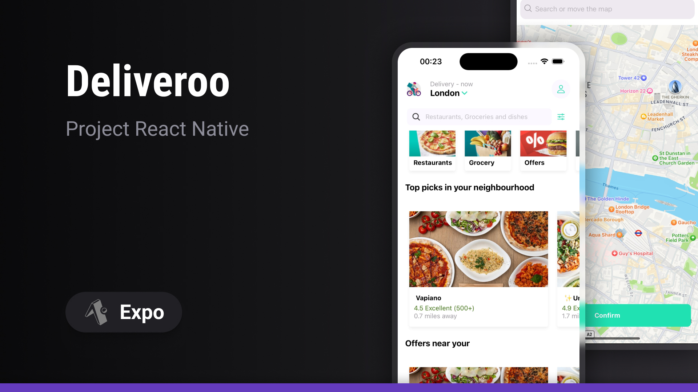
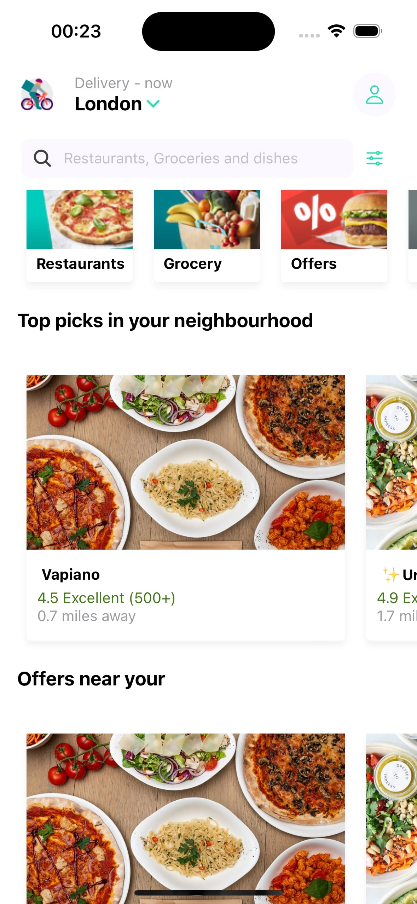
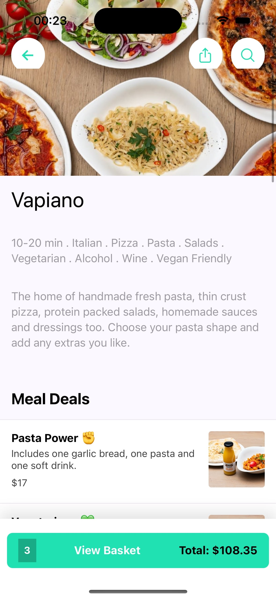
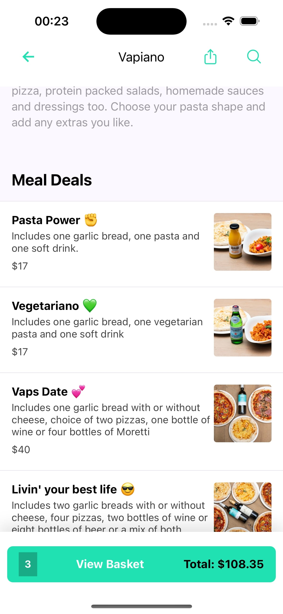
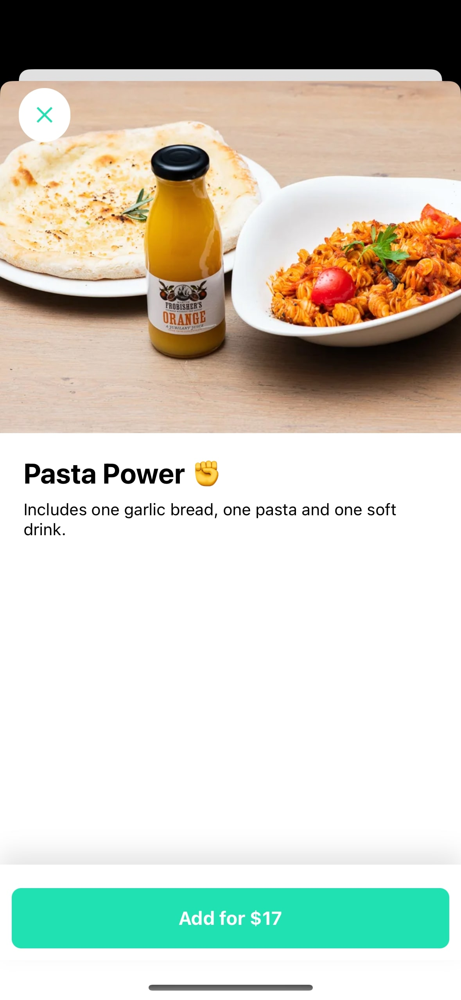
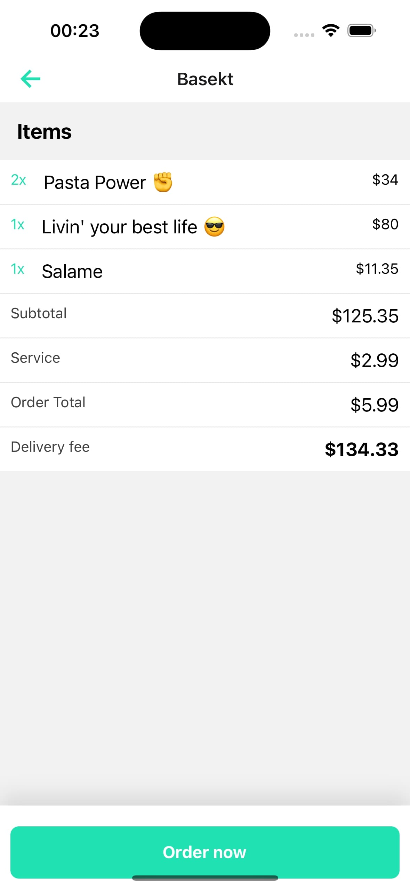
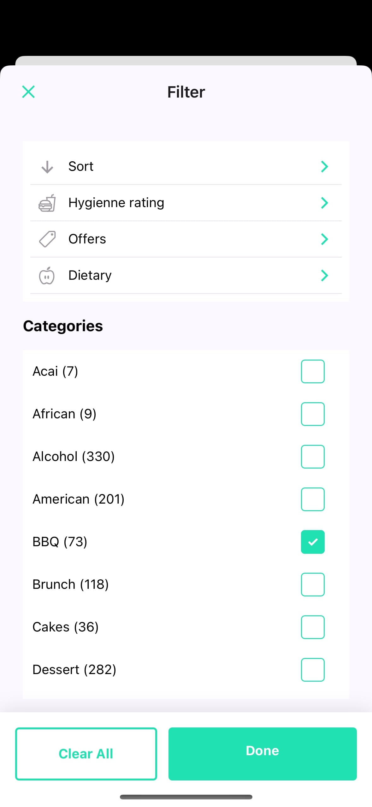
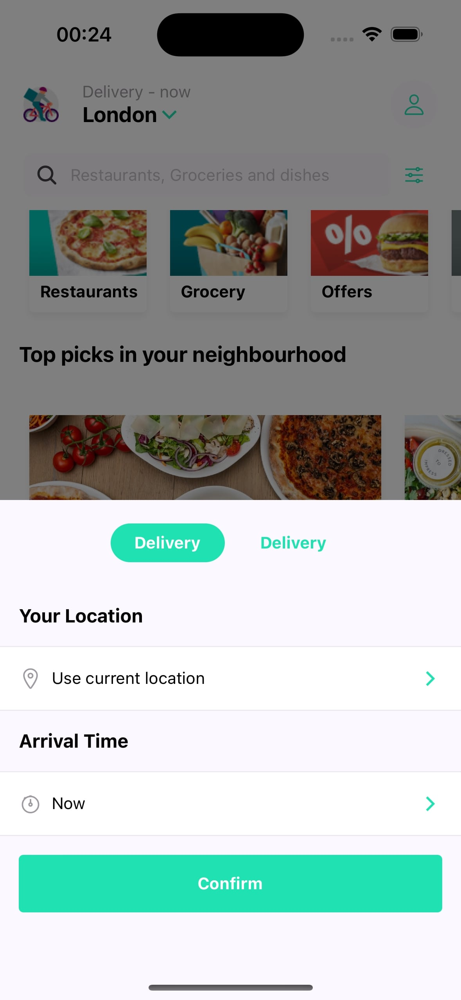
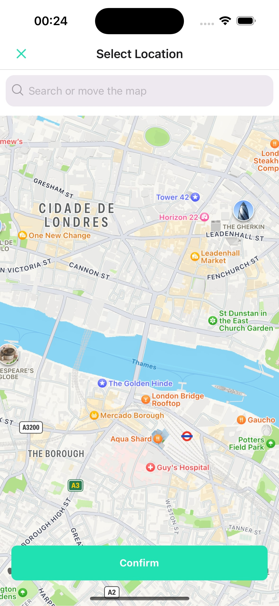

## Sobre o projeto

Deliveroo é um projeto React Native Expo que simula um aplicativo de compras. É um projeto em que utiliza varias tecnologias diferentes para que o usuário tenha uma boa experiência na utilização.
O app simula um sistema de filtragem de produtos além de integração com oa API do Google Maps para geolocalização.

<div align="center">
    
    
    
    
    
    
    
    
</div>

## 🛠 Tecnologias

As seguintes ferramentas foram usadas na construção do projeto:

- [Expo](https://expo.io/)
- [React Native](https://reactnative.dev/)
- [TypeScript](https://www.typescriptlang.org/)
- [Expo Router](https://docs.expo.dev/routing/introduction/)
- [Zustand](https://zustand-demo.pmnd.rs/)

## Pré-requisitos

Antes de começar, você vai precisar ter instalado em sua máquina as seguintes ferramentas:
[Git](https://git-scm.com), [Node.js e npm](https://nodejs.org/en/).

Além disto é bom ter um editor para trabalhar com o código como [VSCode](https://code.visualstudio.com/), e um emulador ou aparelho com o Expo Go instalado.

O projeto utiliza integração com o google maps, não esqueça de obter sua KEY no console do Google e adiciona-la ao `.env`.

### Executando o aplicativo

```bash
# Clone este repositório
$ git clone https://github.com/gustavosorati/deliveroo

# Vá para a pasta server
$ npm install

# Instale as dependências
$ npx expo start
```
